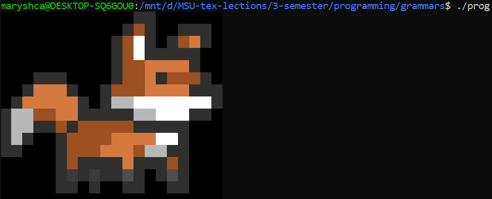

# AVL tree implementation and fun with terminal animations

## Screenshots

## Structure

AVL implementation is in file `avl.h`,
In `main.cpp` you could find tests and implementation of `animated_sprite` and `screen` for sprites classes.

## How to run

1. `git clone ....git`
2. `g++ main.cpp -o prog`
3. `./prog`

